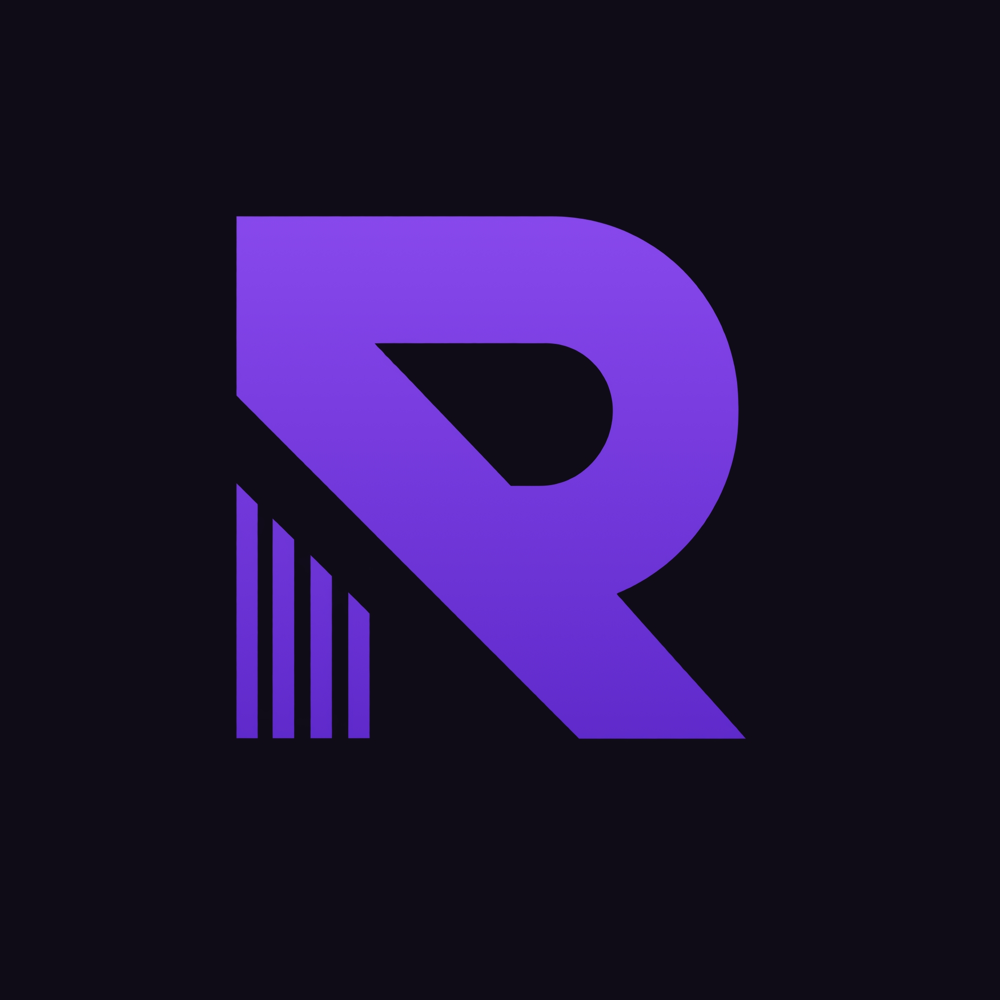
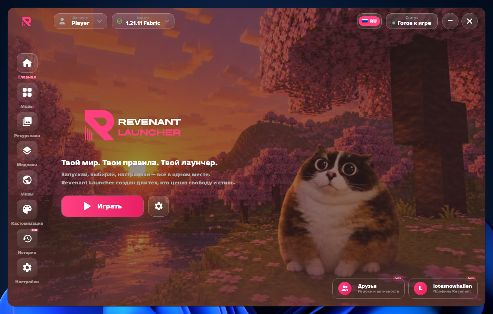
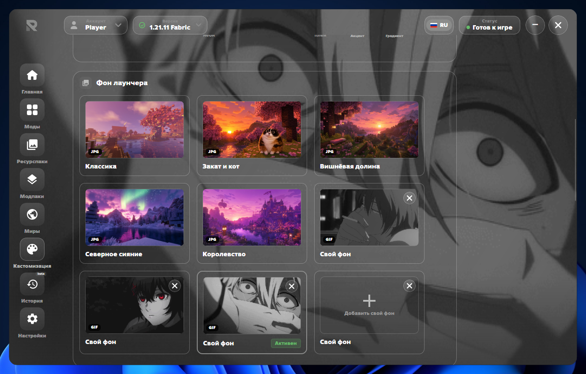
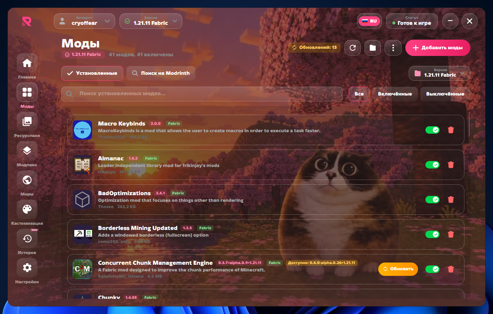

# Revenant Launcher

  

  <b>Современный лаунчер Minecraft для Windows</b> 
  Ваниль · Forge · Fabric · моды и ресурспаки из Modrinth · миры, бэкапы и скриншоты · гибкая кастомизация

  
  
  
  
  

  <a href="https://github.com/wtf40iq/RevenantReleases/releases/latest"><b>⬇ Скачать установщик (Windows)</b></a>
  ·
  <a href="#скриншоты">Скриншоты</a>
  ·
  <a href="#возможности">Возможности</a>
  ·
  <a href="#установка">Установка</a>
  ·
  <a href="#кастомизация">Кастомизация</a>

---

## Скриншоты

> Вставь сюда свои кадры — замени пути ниже. Рекомендуем `docs/screenshots/*.png` 800–1200px шириной.

| Главная | Кастомизация |
|---|---|
|  |  |

| Моды · Modrinth | Миры · бэкапы |
|---|---|
|  |  |

---

## Возможности

**Запуск**
- Ваниль, Forge и Fabric — установка в один клик, изоляция версий, авто-подбор Java
- Свои версии, быстрый выбор загрузчика, окно игры с разрешением и аргументами JVM

**Контент**
- **Моды / Ресурспаки / Модпаки** — поиск и установка напрямую из Modrinth, фильтры по версии и лоадеру, пагинация
- **Миры** — список миров, бэкапы в один клик, скриншоты (`F2`) с превью

**Социальное**
- Аккаунты Revenant, друзья, заявки, чат и активность — без привязки к аккаунту Minecraft

**Кастомизация**
- Темы **Standart / Glass**, акцентные цвета и градиенты, выбор фона (изображение / GIF / видео) с редактором (кроп, масштаб, поворот, отражение)
- Тонировка баннера, цвета интерфейса (окно / панели), эффект дождя, пресеты — экспорт/импорт одним файлом
- Полная локализация **RU / EN**

**Прочее**
- История запусков, Discord Rich Presence, звуки, автообновление через установщик

## Установка

1. Скачай `RevenantLauncherSetup-vX.Y.Z.exe` из [Releases](https://github.com/wtf40iq/RevenantReleases/releases/latest).
2. Запусти установщик — он развернёт лаунчер и создаст ярлык.
3. Открой лаунчер, выбери версию и нажми **Играть**.

> Требуется **Windows 10/11 x64**. Отдельная установка Java не нужна — лаунчер подберёт подходящую версию автоматически.

## Кастомизация

Все настройки — в разделе **Кастомизация**:
- **Акцент** — цвет кнопок, рамок и выделений (ЛКМ — акцент, ПКМ — градиент)
- **Фон** — встроенные баннеры или свой (`JPG/PNG/GIF/WEBP`, в том числе анимированный)
- **Цвета интерфейса** — два базовых цвета (окно / панели), остальное подстраивается автоматически
- **Эффекты** — тонировка баннера и мягкий дождь поверх фона
- **Пресеты** — сохрани текущую тему как именованный конфиг и поделись файлом с другом

## Обновления

Лаунчер проверяет обновления при старте. Когда выходит новая версия — появится баннер с кнопкой обновления. Установщик сохраняет твои аккаунты, настройки и папку Minecraft.

История изменений — в описаниях релизов: [Releases](https://github.com/wtf40iq/RevenantReleases/releases).

## Поддержка

Нашёл баг или есть идея? Создай [Issue](https://github.com/wtf40iq/RevenantReleases/issues) в этом репозитории или напиши автору.

---

  © 2026 lotesnowhallen · Revenant Launcher

